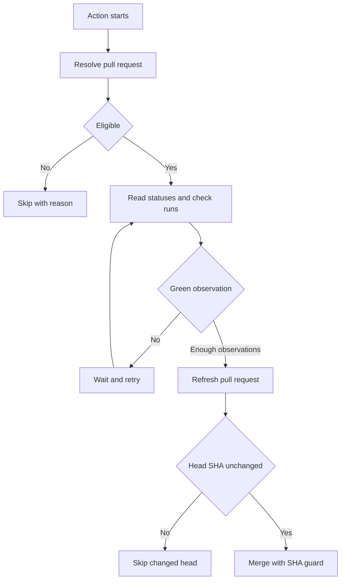

# Design

Automerge is a packaged JavaScript action. The action metadata in `action.yml` points to the bundled `dist/index.js` file, which contains the TypeScript source and runtime dependencies.

## Flow

## Pull Request Resolution

For `pull_request` and `pull_request_target` events, the action reads the pull request number from the event payload and fetches the current pull request from GitHub.

For `check_run` and `status` events, the action resolves the open pull request associated with the reported commit SHA. Events that do not map to an open pull request are skipped.

## Eligibility

The action considers a pull request eligible only when:

- It is open.
- It is not a draft.
- It has the configured label when `require-label` is enabled.
- It is not from a fork unless `allow-forks` is enabled.

Ineligible pull requests are skipped without failing the workflow.

## Check Evaluation

The action reads both commit statuses and check runs for the pull request head SHA.

Statuses must have `state: success`. Check runs must have `status: completed` and `conclusion: success`. Any other visible state resets the green observation counter.

Ignored check names are removed before evaluation. If no statuses or non-ignored check runs remain, the pull request is not green.

## Stable Green Window

The action requires `green-observations-required` consecutive green observations before merging. The delay between observations is controlled by `poll-interval-seconds`, and the whole wait is bounded by `timeout-seconds`.

This guards against integrations that create checks shortly after a pull request update or shortly after another check completes.

## Guarded Merge

Before merging, the action refreshes the pull request and compares the current head SHA with the SHA that was checked. If it changed, the action skips.

When it calls GitHub's merge API, it includes that same SHA. GitHub rejects the merge if the pull request head no longer matches.
